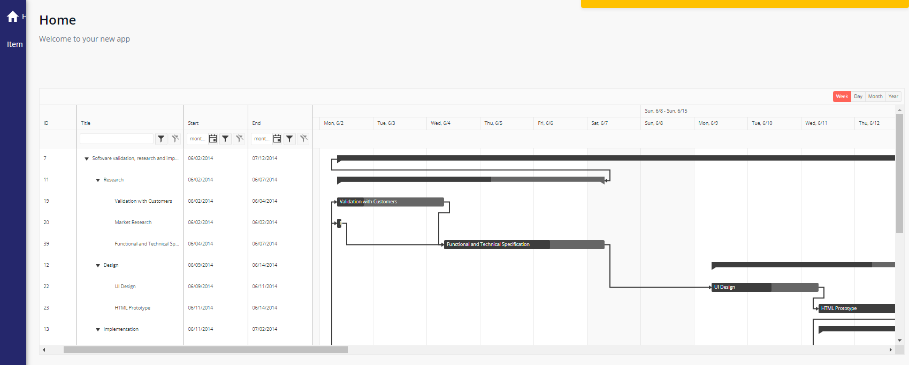
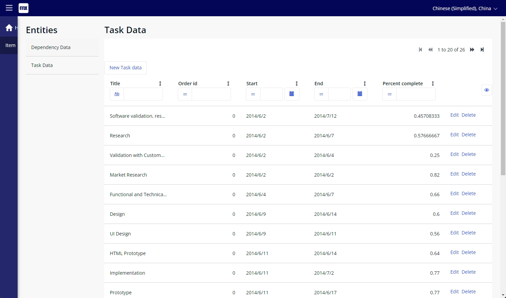
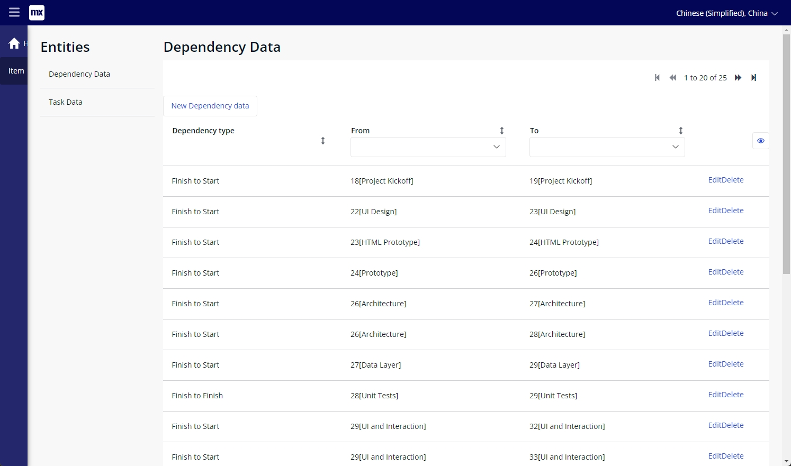

# Seed Data

-   npm run build:seed
-   npm run preview
-   run follow command in console

```js
require(["http://localhost:4173/SeedLib-index.umd.js"]);
```

# Preview

## snap



## config

### task



### dependency


